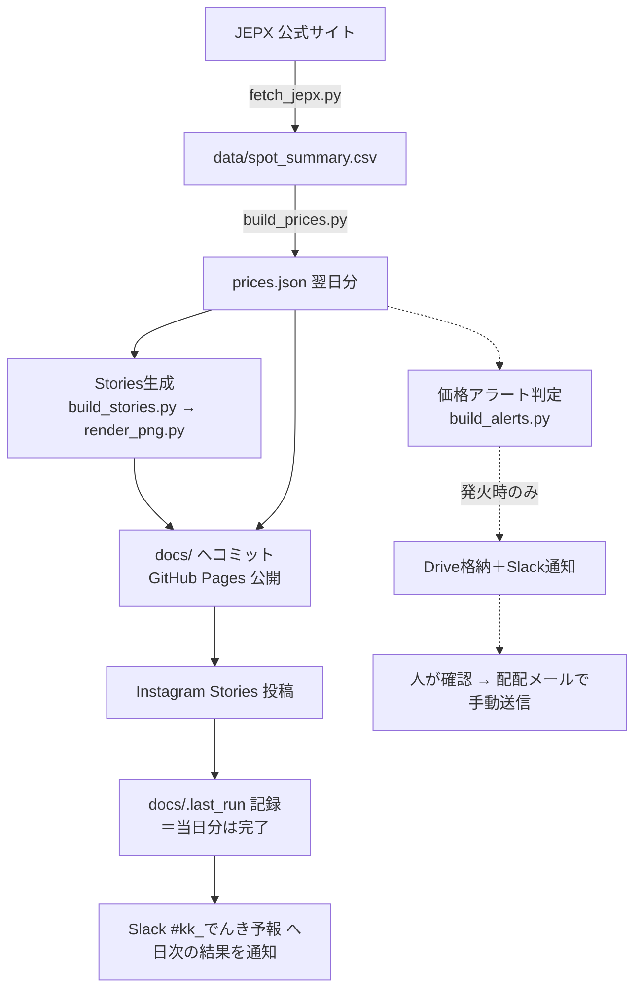

# でんき予報（tera-denki-yohou）

毎朝、翌日の電気の市場価格を自動で取得して、3つの経路で届ける仕組みです。

1. **Web** — [公開ページ](https://tera-energy-jp.github.io/tera-denki-yohou/)にグラフを掲載
2. **Instagram** — テラゾウくんのStories画像を自動投稿
3. **価格アラート** — 高騰しそうな日だけ、お客様向けメールの素材を作って社内に通知

①②は完全自動です。③だけは、**素材を作るところまでが自動で、お客様への送信は人が中身を確認してから手動**で行います。

---

## 全体の流れ

実線が本体フローで、ここが止まると当日の配信ができません。点線は補助フローで、失敗しても本体は止まらないように作ってあります。

アラート（図の右側）は本体から独立しています。アラート側が全部こけても、WebとInstagramの配信には影響しません。

---

## 毎朝Slackに届く通知のこと

処理が終わると、`notify_slack.py` が **#kk_でんき予報** に1通投稿します。件名は「☀️ でんき予報 配信処理完了」。中身は翌日の価格レベル、いちばん安い時間帯、Instagram投稿の成否、Web版へのリンクです。

コードの中では「安否確認」と呼ばれていますが、実際には2つの役割があります。
- **明日の価格の速報**として読まれること。
- この通知が毎朝届くこと自体が**システムが生きている証拠**になること。

---

## 1日のタイムライン（すべてJST）

上の図の流れが、毎朝この時刻どおりに進みます。

| 時刻 | 起きること | Slack |
|---|---|---|
| 〜10:30頃 | JEPXが翌日分の価格を公表 | － |
| 10:40 | GitHubのcron（予備1回目）。遅延しがちで、たいてい間に合わない | － |
| **10:45** | **cron-job.org が起動（1回目）← 実運用はここで走る** | － |
| **10:48頃** | 全処理が完了 | ☀️ 配信処理完了 が1通 |
| 11:10 | GitHubのcron（予備2回目）。配信済みなので何もしない | － |
| 11:30 | 監視（watchdog）1回目 | 正常なら無言。未配信なら ⚠️ |
| 11:40 | GitHubのcron（予備3回目）。配信済みなので何もしない | － |
| **11:45** | **cron-job.org が起動（2回目＝リトライ）** | － |
| 12:30 | 監視（watchdog）2回目 | 正常なら無言。異常なら ⚠️ か 🐢 |
| **12:45** | **cron-job.org が起動（3回目＝最後のリトライ）** | － |

起動がかかったあとは、JEPXからのCSV取得、JSON生成、Stories画像の書き出し、`docs/`へのコミット（＝Web公開）、Instagram投稿、という順で一気に流れます。所要は3分ほどで、最後に `docs/.last_run` へ日付を書いて「今日は完了」の印にします。

起動のきっかけは cron-job.org と GitHub の2系統あり、**普段仕事をしているのは cron-job.org の10:45**です。GitHubのcronは数十分ずれるのが常態なので、10:40に仕掛けてあっても10:45に間に合わないことがほとんどで、実質は「cron-job.orgごと落ちたとき用の保険」として機能しています。どちらが先に走っても、`docs/.last_run` を見るガードがあるので二重配信にはなりません。

価格アラートの判定はこの流れと並行して走ります。しきい値を超えたエリアがあった日だけ、メール素材をGoogle Driveに置いて、アラート用の別チャンネルに通知が飛びます。

**平常時にSlackへ流れるのは、毎朝の「配信処理完了」1通だけです。** これが来ない日、または⚠️🐢が来た日だけ対応が必要になります（→ [運用手順書](ops/runbook.md)）。

### 知っておくと混乱しない2つのこと

**cron-job.orgの設定はこのリポジトリにありません。** 上の表の10:45／11:45／12:45という時刻は、cron-job.org の管理画面で確認した値です。コード側には書かれていないので、**管理画面で時刻を変えるとこのドキュメントとズレます**。変更したときは表も直してください。

**⚠️が出た時点では、まだリトライが残っています。** watchdogは11:30と12:30に確認しますが、cron-job.orgのリトライはその15分後の11:45と12:45です。つまりwatchdogは毎回「リトライ待ちの状態」を見て警告しています。⚠️が出たあと11:45の再実行で復旧し、12:30に🐢が出る、という流れは正常な動きです。すぐ慌てず、まず [運用手順書](ops/runbook.md#1-警告が来たときの初動) の初動手順を確認してください。

---

## もっと詳しく

| 知りたいこと | 読むもの |
|---|---|
| 仕組みの詳細・コードを変更したい | [ops/architecture.md](ops/architecture.md) |
| 止まった・警告が来た・運用したい | [ops/runbook.md](ops/runbook.md) |
| 細かい仕様変更の経緯 | [scripts/軽微修正メモ.md](scripts/軽微修正メモ.md) |

---

## さわる前に知っておくこと（3つだけ）

**1. 正本データはJEPXにあります。** このリポジトリは過去年度の生データを持っていません。過去データを直すときは、推測で埋めずにJEPXから取り直してください。

**2. ワークフローの一見過剰なガードは、全部それぞれ事故の再発防止策です。** `continue-on-error`、`concurrency`、`force` などを消す前に、[障害の履歴](ops/runbook.md#6-過去の障害となぜガードが多いのか) に目を通してください。

**3. `docs/` はGitHub Pagesの公開ディレクトリです。** ここに置いたファイルはインターネットに公開されます。社内向けの資料は `ops/` に置いてください。