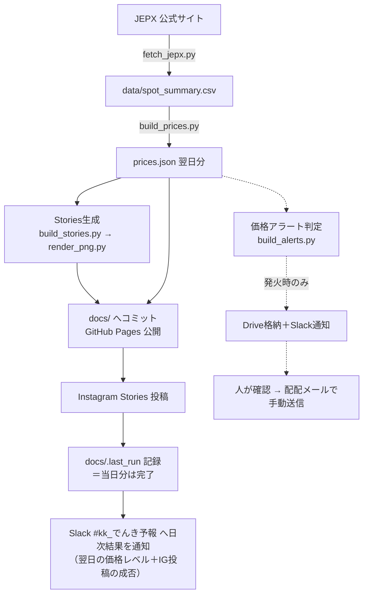

# でんき予報（tera-denki-yohou）

JEPX（日本卸電力取引所）の翌日スポット価格を毎朝自動で取り込み、
**Web公開・Instagram投稿・社内向け価格アラート**の3つを自動で作って配る仕組みです。

- 公開ページ：`docs/index.html`（GitHub Pages）
- 人の手が要るのは1か所だけ：価格アラートのお客様向け配信（配配メール）は、**必ず人が中身を確認してから手動で送る**運用です

---

## 全体の流れ

実線＝本体フロー。点線＝補助フロー（失敗しても本体を止めない）。
アラート系は本体と独立しており、アラート側が全滅しても Web・Instagram の配信には影響しません。

最後のSlack通知（`notify_slack.py`）は、コード上は「安否確認」と呼ばれている**日次の結果報告**です。「☀️ でんき予報 配信処理完了」という件名で、翌日の価格レベル（高め／おだやか等）・最安の時間帯・Instagram投稿の成否・Web版へのリンクが毎朝1通届きます。この通知が毎朝来ていること自体が「システムが正常に動いている」証拠でもあるため、二重の役割（価格速報 兼 死活監視）を持っています。

---

## 1日のタイムライン（すべてJST）

上の「全体の流れ」が、毎朝この順番・この時刻で自動的に転がっていきます。

| 時刻 | 起きること | Slackに流れるもの |
|---|---|---|
| 〜10:30頃 | JEPXが翌日分のスポット約定結果を公表 | － |
| 10:30過ぎ | **cron-job.org**（外部サービス）が本体ワークフローを起動。図の左上から順に、JEPX取得 → JSON生成 → Stories画像生成 → `docs/`コミット（Web公開）→ Instagram投稿 と一気に流れる | － |
| （同時並行） | 価格アラート判定。しきい値を超えたエリアがある日だけ、メール素材をDriveへ格納 | 発火日のみ、アラート用チャンネル（`SLACK_ALERT_WEBHOOK_URL`）に通知 → これを見た人が配配メールで手動送信 |
| **10:4x** | 全処理完了。仕上げに `docs/.last_run` へ完了マーカーを記録 | **#kk_でんき予報 に「☀️ 配信処理完了」が1通**（翌日の価格レベル・最安時間帯・IG成否・Webリンク入り）。実績ベースでは毎朝10:48ごろ |
| 10:40 / 11:10 / 11:40 | GitHubネイティブcron（予備）が起動。配信済みならguardでスキップして何もしない | 正常時は何も流れない |
| 11:30 / 12:30 | 監視（watchdog）が `docs/.last_run` を確認 | 未配信なら⚠️警告、完了が11:00以降なら🐢遅延注意を **#kk_でんき予報** へ。正常なら何も流れない |

つまり平常時にSlackへ流れるのは、**毎朝10:4x台の「配信処理完了」1通だけ**です。この通知が来ていない、または⚠️🐢の警告が来た場合のみ、対応が必要です（初動は [運用手順書](ops/runbook.md) へ）。

> ⚠️ **cron-job.orgの設定（発火時刻・PAT）はこのリポジトリに書かれていません。** 管理画面側が正です。「リポジトリを全部読んだのに発火時刻が分からない」のは正常です。
> ⚠️ watchdogの1回目（11:30）は最後の予備cron（11:40）より**先に**走るため、⚠️警告のあと自然復旧するパターンがあります。警告が来たら慌てる前に [運用手順書](ops/runbook.md) の初動手順へ。

---

## ドキュメント案内

| 読みたいこと | 場所 |
|---|---|
| **仕組みを詳しく知りたい・変更を加えたい**：処理ステップの詳細、ファイル対応表、JSON仕様、データ方針 | [ops/architecture.md](ops/architecture.md) |
| **止まった・警告が来た・運用したい**：障害時の初動、アラートの手動送信手順、過去の障害と設計理由、Secrets一覧、ローカル動作確認 | [ops/runbook.md](ops/runbook.md) |
| 細かい仕様変更の経緯を知りたい：円表記の統一、しきい値の一元管理などのレビュー対応記録 | [scripts/軽微修正メモ.md](scripts/軽微修正メモ.md) |

---

## さわる前に知っておくこと（3つだけ）

1. **正本データはJEPX**。このリポジトリは過去年度の生データを持ちません。過去データの改定は「推測で埋める」のではなく「JEPXから取り直す」が鉄則です。
2. **ワークフローのガード（`continue-on-error`・`concurrency`・`force`入力など）は全部、実際に起きた事故への対策です**。消す前に [runbook の障害履歴](ops/runbook.md#過去の障害となぜガードが多いのか) を読んでください。
3. `docs/` は**GitHub Pagesの公開ディレクトリ**です。ここに置いたものはWebに公開されます。内部資料は `ops/` へ。