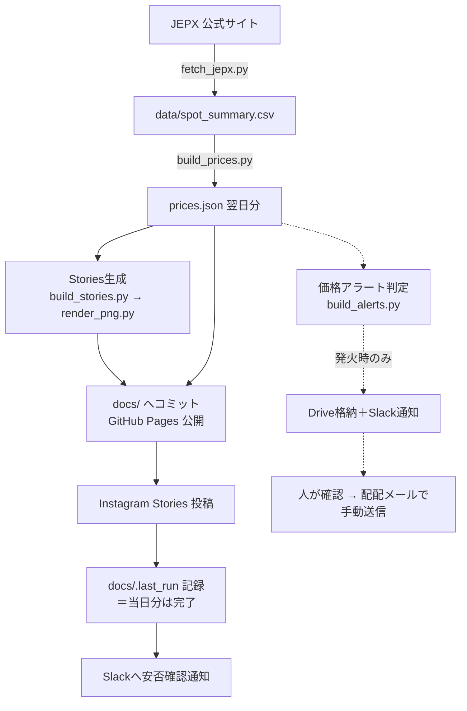

# でんき予報（tera-denki-yohou）

JEPX（日本卸電力取引所）の翌日スポット価格を毎朝自動で取り込み、
**Web公開・Instagram投稿・社内向け価格アラート**の3つを自動で作って配る仕組みです。

- 公開ページ：`docs/index.html`（GitHub Pages）
- 人の手が要るのは1か所だけ：価格アラートのお客様向け配信（配配メール）は、**必ず人が中身を確認してから手動で送る**運用です

---

## 全体の流れ

実線＝本体フロー。点線＝補助フロー（失敗しても本体を止めない）。
アラート系は本体と独立しており、アラート側が全滅しても Web・Instagram の配信には影響しません。

---

## 1日のタイムライン（すべてJST）

| 時刻 | 起きること |
|---|---|
| 〜10:30頃 | JEPXが翌日分のスポット約定結果を公表 |
| 10:30過ぎ | **cron-job.org**（外部サービス）が本体ワークフローを起動 |
| **10:4x** | 正常時はここまでに全処理が完了 |
| 10:40 / 11:10 / 11:40 | GitHubネイティブcron（予備）。配信済みならスキップ |
| 11:30 / 12:30 | 監視（watchdog）が未配信・遅延をSlackへ警告 |

> ⚠️ **cron-job.orgの設定（発火時刻・PAT）はこのリポジトリに書かれていません。** 管理画面側が正です。「リポジトリを全部読んだのに発火時刻が分からない」のは正常です。
> ⚠️ watchdogの1回目（11:30）は最後の予備cron（11:40）より**先に**走るため、⚠️警告のあと自然復旧するパターンがあります。警告が来たら慌てる前に [運用手順書](ops/runbook.md) の初動手順へ。

---

## ドキュメント案内

| 読みたいこと | 場所 |
|---|---|
| **仕組みを詳しく知りたい・変更を加えたい**：処理ステップの詳細、ファイル対応表、JSON仕様、データ方針 | [ops/architecture.md](ops/architecture.md) |
| **止まった・警告が来た・運用したい**：障害時の初動、アラートの手動送信手順、過去の障害と設計理由、Secrets一覧、ローカル動作確認 | [ops/runbook.md](ops/runbook.md) |
| 細かい仕様変更の履歴 | [scripts/軽微修正メモ.md](scripts/軽微修正メモ.md) |

---

## さわる前に知っておくこと（3つだけ）

1. **正本データはJEPX**。このリポジトリは過去年度の生データを持ちません。過去データの改定は「推測で埋める」のではなく「JEPXから取り直す」が鉄則です。
2. **ワークフローのガード（`continue-on-error`・`concurrency`・`force`入力など）は全部、実際に起きた事故への対策です**。消す前に [runbook の障害履歴](ops/runbook.md#過去の障害となぜガードが多いのか) を読んでください。
3. `docs/` は**GitHub Pagesの公開ディレクトリ**です。ここに置いたものはWebに公開されます。内部資料は `ops/` へ。